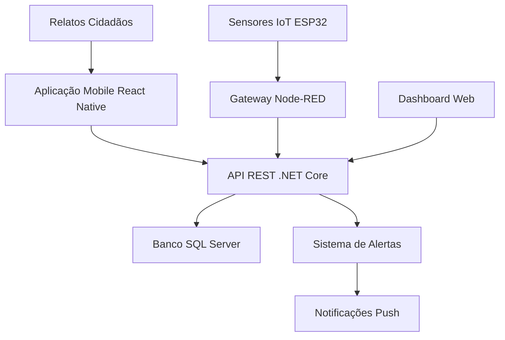

# 📱 IdeaTec Sistema de Alerta para Eventos Extremos

## 🌊 Sistema Integrado de Monitoramento e Alerta para Desastres Naturais


---

## 📋 Índice

- [Sobre o Projeto](#-sobre-o-projeto)
- [Integrantes](#-integrantes)
- [Tecnologias Utilizadas](#-tecnologias-utilizadas)
- [Funcionalidades](#-funcionalidades)
- [Arquitetura da Solução](#-arquitetura-da-solução)
- [Pré-requisitos](#-pré-requisitos)
- [Instalação e Configuração](#-instalação-e-configuração)
- [Como Executar](#-como-executar)
- [Estrutura do Projeto](#-estrutura-do-projeto)
- [API Endpoints](#-api-endpoints)
- [Screenshots](#-screenshots)
- [Demonstração](#-demonstração)
- [Contribuição](#-contribuição)
- [Licença](#-licença)

---

## 🌍 Sobre o Projeto

O **IdeaTec Sistema de Alerta para Eventos Extremos** é uma solução tecnológica inovadora desenvolvida para enfrentar os desafios dos **eventos climáticos extremos** que afetam comunidades urbanas. Nossa plataforma integra **Internet das Coisas (IoT)**, **inteligência artificial** e **tecnologias móveis** para criar um sistema de alerta antecipado que protege vidas e propriedades.

### 🎯 Problema Identificado

Com o aumento da frequência e intensidade de eventos extremos como enchentes, alagamentos e tempestades severas, há uma necessidade crítica de sistemas que possam:

- **Detectar precocemente** situações de risco
- **Alertar automaticamente** a população em tempo real
- **Coordenar respostas** de emergência de forma eficiente
- **Facilitar relatos** da comunidade para mapeamento colaborativo

### 💡 Nossa Solução

Desenvolvemos um **ecossistema tecnológico completo** que combina:

1. **📱 Aplicação Mobile React Native** - Interface intuitiva para cidadãos e autoridades
2. **🔗 API REST .NET Core** - Backend robusto para processamento de dados
3. **🌐 Sistema IoT** - Rede de sensores para monitoramento em tempo real
4. **📊 Dashboard Inteligente** - Visualização e análise de dados

### 🏆 Diferenciais Competitivos

- **Detecção Proativa**: Sensores IoT estrategicamente posicionados
- **Alertas Personalizados**: Notificações baseadas em localização e perfil de risco
- **Participação Cidadã**: Sistema colaborativo de relatos da comunidade
- **Integração Total**: Plataforma unificada para todas as etapas do gerenciamento de crises


---

## 🚀 Tecnologias Utilizadas

### 📱 Mobile Application (React Native)
- **React Native** 0.79.2
- **Expo SDK** 53.0.11
- **TypeScript** para type safety
- **React Navigation** para navegação
- **Axios** para integração com API
- **Material Icons** para UI consistente

### 🔧 Backend API (.NET)
- **.NET Core** 8.0
- **Entity Framework Core** para ORM
- **SQL Server** para persistência
- **Swagger** para documentação automática
- **JWT** para autenticação
- **Docker** para containerização

### 🌐 IoT & Infrastructure
- **ESP32/Arduino** para sensores
- **Node-RED** como gateway IoT
- **MQTT** para comunicação entre dispositivos
- **Docker Compose** para orquestração
- **GitHub Actions** para CI/CD

### 🎨 Design & UX
- **Figma** para prototipagem
- **Material Design** como base visual
- **Tema personalizado** IdeaTec
- **Design responsivo** multi-plataforma

---

## ⚡ Funcionalidades

### 🎯 Core Features

#### 📍 **Monitoramento de Zonas de Risco**
- Visualização de zonas cadastradas pela equipe técnica
- Status em tempo real de cada área monitorada
- Níveis de alerta configuráveis por região
- Histórico de eventos por localização

#### 📱 **Sistema de Relatos Comunitários**
- Interface simplificada para relatos de cidadãos
- Categorização automática por gravidade
- Localização automática para proteção de privacidade
- Sistema de acompanhamento de status

#### 📊 **Dashboard Executivo**
- Estatísticas em tempo real do sistema
- Indicadores de performance dos sensores
- Métricas de alertas e ocorrências
- Status geral do sistema de monitoramento

#### 🔔 **Sistema de Alertas Inteligente**
- Alertas baseados em níveis críticos configuráveis
- Notificações push personalizadas
- Escalabilidade automática conforme gravidade
- Histórico completo de alertas emitidos

#### 📈 **Análise de Dados Históricos**
- Relatórios de leituras dos sensores
- Análise de tendências de eventos extremos
- Filtros por região e período
- Exportação de dados para análise

### 🔧 Technical Features

- **CRUD Completo** integrado com API .NET
- **Navegação fluida** entre 5+ telas
- **Tipagem TypeScript** rigorosa
- **Tratamento robusto** de erros
- **Cache inteligente** para performance
- **Offline capability** com sincronização

---

## 🏗️ Arquitetura da Solução



### 🔄 Fluxo de Dados

1. **Coleta**: Sensores IoT coletam dados ambientais
2. **Processamento**: Gateway Node-RED processa e encaminha dados
3. **Armazenamento**: API .NET persiste informações no SQL Server
4. **Análise**: Sistema analisa padrões e define níveis de alerta
5. **Notificação**: Alertas são enviados via push notifications
6. **Interação**: Usuários visualizam dados e criam relatos via mobile

---

## 📋 Pré-requisitos

### 🖥️ Desenvolvimento
- **Node.js** 18.x ou superior
- **npm** ou **yarn**
- **Expo CLI** instalado globalmente
- **.NET 8.0 SDK**
- **SQL Server** ou **SQL Server LocalDB**
- **Git** para versionamento

### 📱 Execução Mobile
- **Android Studio** (para emulador Android)
- **Xcode** (para emulador iOS - apenas macOS)
- **Expo Go** app (para teste em dispositivo físico)

### 🔧 Desenvolvimento Backend
- **Visual Studio 2022** ou **VS Code**
- **SQL Server Management Studio** (opcional)
- **Postman** (para testes de API)

---

## 🛠️ Instalação e Configuração

```
# Navegue para o diretório
cd ideatec-sistema-alerta
```

### Configuração do Backend (.NET)

```bash
# Navegue para o diretório da API
cd backend/ApiMonitoramentoEnchentes

# Restaure as dependências
dotnet restore

# Configure a string de conexão no appsettings.json
# Edite o arquivo appsettings.json com suas configurações de banco

# Execute as migrations
dotnet ef database update

# Execute a API
dotnet run
```

### Configuração do Mobile (React Native)

```bash
# Navegue para o diretório mobile
cd mobile/ideatec-rain-controller

# Instale as dependências
npm install

# Configure as variáveis de ambiente
cp .env.example .env
# Edite o arquivo .env com as configurações da sua API

# Inicie o projeto Expo
npx expo start
```

#### Mobile (React Native) - `.env`:
```env
EXPO_PUBLIC_API_URL=http://192.168.1.100:5000/api
EXPO_PUBLIC_APP_ENV=development
EXPO_PUBLIC_DEBUG_MODE=true
```

---

## ▶️ Como Executar

### 🔥 Início Rápido

1. **Inicie o Backend**:
```bash
cd backend/ApiMonitoramentoEnchentes
dotnet run
```
A API estará disponível em: `http://localhost:5000`
Documentação Swagger: `http://localhost:5000/swagger`

2. **Inicie o Mobile**:
```bash
cd mobile/ideatec-rain-controller
npx expo start
```

3. **Escolha uma opção**:
   - **Android**: Pressione `a` ou escaneie o QR code com Expo Go
   - **iOS**: Pressione `i` ou escaneie o QR code com a câmera
   - **Web**: Pressione `w` para abrir no navegador

### 🧪 Execução de Testes

```bash
# Testes do Backend
cd backend/ApiMonitoramentoEnchentes
dotnet test

# Testes do Mobile
cd mobile/ideatec-rain-controller
npm test
```

### 🐳 Execução com Docker

```bash
# Execute toda a stack com Docker Compose
docker-compose up -d

# Para parar os serviços
docker-compose down
```

---

## 📁 Estrutura do Projeto

```
ideatec-sistema-alerta/
├── 📱 mobile/
│   └── ideatec-rain-controller/
│       ├── 📂 src/
│       │   ├── 🎨 components/
│       │   │   ├── common/
│       │   │   └── forms/
│       │   ├── 📱 screens/
│       │   ├── 🔧 services/
│       │   ├── 🎯 types/
│       │   ├── 🧭 navigation/
│       │   ├── 🎨 styles/
│       │   └── 🛠️ utils/
│       ├── 📦 package.json
│       └── ⚙️ app.json
```

---

## 🔌 API Endpoints

### 📍 Zonas de Risco
```http
GET    /api/ZonaDeRisco          # Listar todas as zonas
GET    /api/ZonaDeRisco/{id}     # Buscar zona por ID
POST   /api/ZonaDeRisco          # Criar nova zona
PUT    /api/ZonaDeRisco/{id}     # Atualizar zona
DELETE /api/ZonaDeRisco/{id}     # Deletar zona
```

### 📡 Sensores
```http
GET    /api/Sensor               # Listar todos os sensores
GET    /api/Sensor/{id}          # Buscar sensor por ID
GET    /api/Sensor/PorZona/{id}  # Sensores por zona
```

### 📊 Leituras
```http
GET    /api/Leitura              # Histórico de leituras
GET    /api/Leitura/Recentes     # Leituras mais recentes
POST   /api/Leitura              # Registrar nova leitura
```

### 🔔 Alertas
```http
GET    /api/Alerta               # Listar alertas
GET    /api/Alerta/Ativos        # Alertas ativos
POST   /api/Alerta               # Criar alerta
PUT    /api/Alerta/{id}          # Atualizar alerta
```

### 📝 Ocorrências
```http
GET    /api/OcorrenciaUsuario    # Relatos de usuários
POST   /api/OcorrenciaUsuario    # Criar relato
PUT    /api/OcorrenciaUsuario/{id} # Atualizar status
DELETE /api/OcorrenciaUsuario/{id} # Deletar relato
```

---

## 📱 Screenshots


### 🏠 Tela Principal
*Dashboard com estatísticas em tempo real do sistema*

### 📍 Zonas de Monitoramento
*Visualização das áreas sob vigilância da IdeaTec*

### 📝 Sistema de Relatos
*Interface simplificada para relatos da comunidade*

### 🔔 Alertas Ativos
*Gerenciamento de alertas em tempo real*

### 📊 Histórico de Leituras
*Análise temporal dos dados dos sensores*


### ⚡ Features em Destaque

- ✅ **Navegação fluida** entre 5 telas principais
- ✅ **CRUD completo** integrado com API .NET
- ✅ **Sistema de alertas** em tempo real
- ✅ **Interface responsiva** e acessível
- ✅ **Integração IoT** com sensores reais
- ✅ **Dados simulados** para demonstração


---


### 👨‍💻 Equipe de Desenvolvimento

| Membro | Email | LinkedIn |
|--------|-------|----------|
| Carlos Eduardo | carlos.pacheco@ideatec.com.br |
| João Pedro | joao.virgens@ideatec.com.br |
| Pedro Augusto | pedro.ladeira@ideatec.com.br |


---
=======
---
